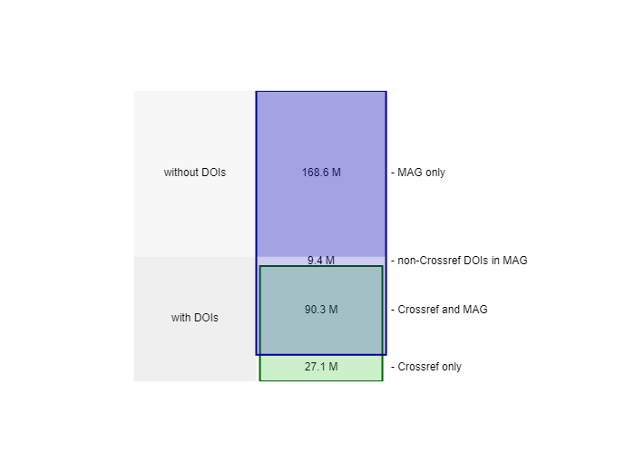
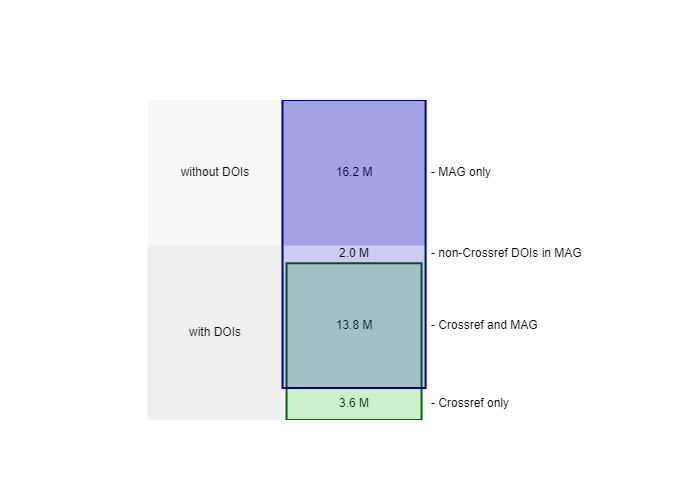
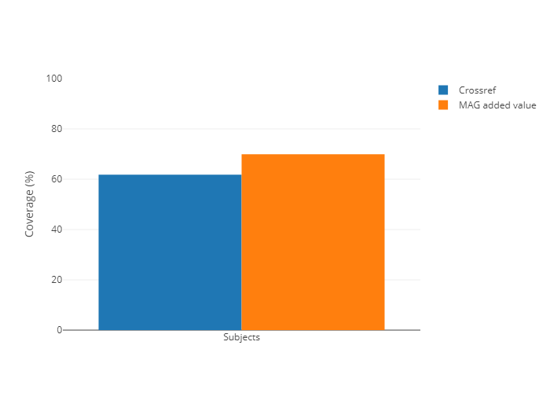
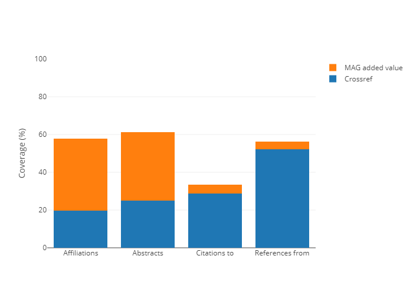
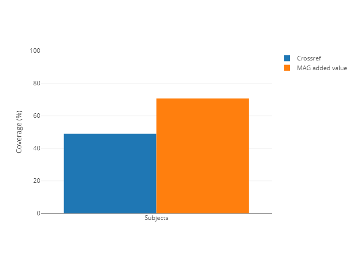
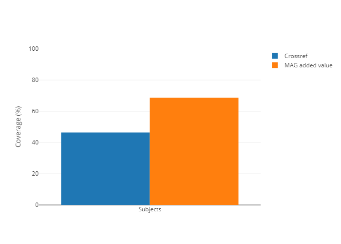
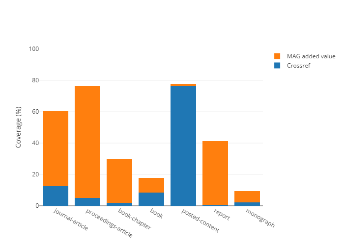
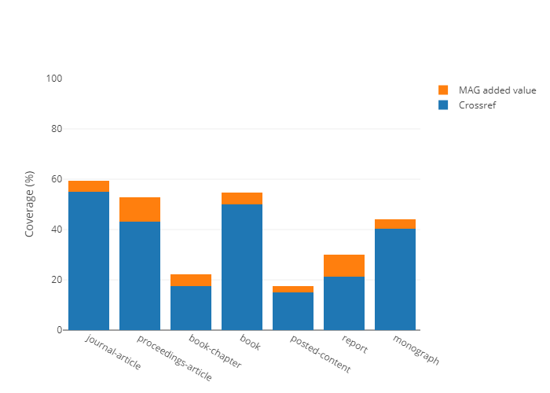

<!-- Title Page -->
<pdf:nexttemplate name="titlepage">
<pdf:nextpage>

TITLE

 DATE: 05 DECEMBER 2021

<!-- switch page templates -->
<pdf:nexttemplate name="report">

<pdf:nextpage>

# Summary and Abstract

Some text goes here

# Exciting things like data and table

Overall coverage of DOIs in MAG and Crossref metadata

Coverage for outputs published in 2020

Coverage for "current" outputs (published 2019-21)

Alluvial Current

MAG Value Add All Time

MAG Value Add "Current" (2019-21)

MAG Value Add 2020

Value Add By Crossref Type

Abstracts

Affiliations

Citations to

References from

Subjects

Crossref coverage in MAG by Pubdate

<!-- switch to landscape page template -->
<pdf:nexttemplate name="landscape-report">

<pdf:nextpage>

<table>
    <caption><strong>Table 2.</strong> Metadata Coverage and MAG Value Add for Crossref DOIs</caption>
    <thead>
        <tr>
            
                <th 
                    
                    text-align=center>Time Period
                </th>
            
                <th 
                    
                    text-align=center>Total DOIs
                </th>
            
                <th 
                    
                    text-align=center>CR Affiliation (%)
                </th>
            
                <th 
                    
                    text-align=center>CR ORCIDS (%)
                </th>
            
                <th 
                    
                    text-align=center>CR Abstract (%)
                </th>
            
                <th 
                    
                    text-align=center>CR Subject (%)
                </th>
            
                <th 
                    
                    text-align=center>CR Citations to (%)
                </th>
            
                <th 
                    
                    text-align=center>CR References from (%)
                </th>
            
                <th 
                    
                    text-align=center>CR Open References (%)
                </th>
            
                <th 
                    
                    text-align=center>MAG Added Affiliation String (%)
                </th>
            
                <th 
                    
                    text-align=center>MAG Added Author ID (%)
                </th>
            
                <th 
                    
                    text-align=center>MAG Added Abstract (%)
                </th>
            
                <th 
                    
                    text-align=center>MAG With Level 0 Field (%)
                </th>
            
                <th 
                    
                    text-align=center>MAG Added Subject (%)
                </th>
            
                <th 
                    
                    text-align=center>MAG Added Citations (%)
                </th>
            
                <th 
                    
                    text-align=center>MAG Higher Citation Count (%)
                </th>
            
                <th 
                    
                    text-align=center>MAG Added References (%)
                </th>
            
                <th 
                    
                    text-align=center>MAG Higher Reference Count (%)
                </th>
            
                <th 
                    
                    text-align=center>MAG Added to Open References (%)
                </th>
            
        </tr>
    </thead>
    <tbody>
        
            <tr style="background-color: white;">
                
                    <td text-align=center>All Time</td>
                
                    <td text-align=center>117308423</td>
                
                    <td text-align=center>13</td>
                
                    <td text-align=center>6</td>
                
                    <td text-align=center>10</td>
                
                    <td text-align=center>62</td>
                
                    <td text-align=center>47</td>
                
                    <td text-align=center>47</td>
                
                    <td text-align=center>42</td>
                
                    <td text-align=center>39</td>
                
                    <td text-align=center>70</td>
                
                    <td text-align=center>43</td>
                
                    <td text-align=center>68</td>
                
                    <td text-align=center>19</td>
                
                    <td text-align=center>4</td>
                
                    <td text-align=center>27</td>
                
                    <td text-align=center>6</td>
                
                    <td text-align=center>10</td>
                
                    <td text-align=center>10</td>
                
            </tr>
        
            <tr style="background-color: Gainsboro;">
                
                    <td text-align=center>Crossref Current 2019-21</td>
                
                    <td text-align=center>17391660</td>
                
                    <td text-align=center>20</td>
                
                    <td text-align=center>26</td>
                
                    <td text-align=center>25</td>
                
                    <td text-align=center>49</td>
                
                    <td text-align=center>29</td>
                
                    <td text-align=center>52</td>
                
                    <td text-align=center>47</td>
                
                    <td text-align=center>32</td>
                
                    <td text-align=center>49</td>
                
                    <td text-align=center>32</td>
                
                    <td text-align=center>62</td>
                
                    <td text-align=center>23</td>
                
                    <td text-align=center>2</td>
                
                    <td text-align=center>5</td>
                
                    <td text-align=center>3</td>
                
                    <td text-align=center>6</td>
                
                    <td text-align=center>6</td>
                
            </tr>
        
            <tr style="background-color: white;">
                
                    <td text-align=center>2020 Only</td>
                
                    <td text-align=center>6884382</td>
                
                    <td text-align=center>20</td>
                
                    <td text-align=center>26</td>
                
                    <td text-align=center>26</td>
                
                    <td text-align=center>46</td>
                
                    <td text-align=center>30</td>
                
                    <td text-align=center>52</td>
                
                    <td text-align=center>46</td>
                
                    <td text-align=center>34</td>
                
                    <td text-align=center>52</td>
                
                    <td text-align=center>32</td>
                
                    <td text-align=center>67</td>
                
                    <td text-align=center>26</td>
                
                    <td text-align=center>2</td>
                
                    <td text-align=center>5</td>
                
                    <td text-align=center>3</td>
                
                    <td text-align=center>6</td>
                
                    <td text-align=center>6</td>
                
            </tr>
        
    </tbody>
</table>

<table>
    <caption><strong>Table 2.</strong> Metadata Coverage and MAG Value Add by Crossref Type - All Time</caption>
    <thead>
        <tr>
            
                <th 
                    
                    text-align=center>Crossref Type
                </th>
            
                <th 
                    
                    text-align=center>Total DOIs
                </th>
            
                <th 
                    
                    text-align=center>CR Affiliation (%)
                </th>
            
                <th 
                    
                    text-align=center>CR ORCIDS (%)
                </th>
            
                <th 
                    
                    text-align=center>CR Abstract (%)
                </th>
            
                <th 
                    
                    text-align=center>CR Subject (%)
                </th>
            
                <th 
                    
                    text-align=center>CR Citations to (%)
                </th>
            
                <th 
                    
                    text-align=center>CR References from (%)
                </th>
            
                <th 
                    
                    text-align=center>CR Open References (%)
                </th>
            
                <th 
                    
                    text-align=center>MAG Added Affiliation String (%)
                </th>
            
                <th 
                    
                    text-align=center>MAG Added Author ID (%)
                </th>
            
                <th 
                    
                    text-align=center>MAG Added Abstract (%)
                </th>
            
                <th 
                    
                    text-align=center>MAG With Level 0 Field (%)
                </th>
            
                <th 
                    
                    text-align=center>MAG Added Subject (%)
                </th>
            
                <th 
                    
                    text-align=center>MAG Added Citations (%)
                </th>
            
                <th 
                    
                    text-align=center>MAG Higher Citation Count (%)
                </th>
            
                <th 
                    
                    text-align=center>MAG Added References (%)
                </th>
            
                <th 
                    
                    text-align=center>MAG Higher Reference Count (%)
                </th>
            
                <th 
                    
                    text-align=center>MAG Added to Open References (%)
                </th>
            
        </tr>
    </thead>
    <tbody>
        
            <tr style="background-color: white;">
                
                    <td text-align=center>journal-article</td>
                
                    <td text-align=center>89387747</td>
                
                    <td text-align=center>14</td>
                
                    <td text-align=center>7</td>
                
                    <td text-align=center>12</td>
                
                    <td text-align=center>80</td>
                
                    <td text-align=center>55</td>
                
                    <td text-align=center>51</td>
                
                    <td text-align=center>47</td>
                
                    <td text-align=center>44</td>
                
                    <td text-align=center>75</td>
                
                    <td text-align=center>47</td>
                
                    <td text-align=center>75</td>
                
                    <td text-align=center>11</td>
                
                    <td text-align=center>4</td>
                
                    <td text-align=center>30</td>
                
                    <td text-align=center>7</td>
                
                    <td text-align=center>11</td>
                
                    <td text-align=center>10</td>
                
            </tr>
        
            <tr style="background-color: Gainsboro;">
                
                    <td text-align=center>book-chapter</td>
                
                    <td text-align=center>14648704</td>
                
                    <td text-align=center>1</td>
                
                    <td text-align=center>0</td>
                
                    <td text-align=center>2</td>
                
                    <td text-align=center>0</td>
                
                    <td text-align=center>18</td>
                
                    <td text-align=center>39</td>
                
                    <td text-align=center>38</td>
                
                    <td text-align=center>24</td>
                
                    <td text-align=center>53</td>
                
                    <td text-align=center>26</td>
                
                    <td text-align=center>40</td>
                
                    <td text-align=center>40</td>
                
                    <td text-align=center>4</td>
                
                    <td text-align=center>12</td>
                
                    <td text-align=center>1</td>
                
                    <td text-align=center>3</td>
                
                    <td text-align=center>1</td>
                
            </tr>
        
            <tr style="background-color: white;">
                
                    <td text-align=center>proceedings-article</td>
                
                    <td text-align=center>6056966</td>
                
                    <td text-align=center>15</td>
                
                    <td text-align=center>0</td>
                
                    <td text-align=center>5</td>
                
                    <td text-align=center>0</td>
                
                    <td text-align=center>43</td>
                
                    <td text-align=center>53</td>
                
                    <td text-align=center>11</td>
                
                    <td text-align=center>58</td>
                
                    <td text-align=center>90</td>
                
                    <td text-align=center>69</td>
                
                    <td text-align=center>88</td>
                
                    <td text-align=center>88</td>
                
                    <td text-align=center>9</td>
                
                    <td text-align=center>34</td>
                
                    <td text-align=center>12</td>
                
                    <td text-align=center>14</td>
                
                    <td text-align=center>50</td>
                
            </tr>
        
            <tr style="background-color: Gainsboro;">
                
                    <td text-align=center>dataset</td>
                
                    <td text-align=center>1264421</td>
                
                    <td text-align=center>31</td>
                
                    <td text-align=center>14</td>
                
                    <td text-align=center>0</td>
                
                    <td text-align=center>0</td>
                
                    <td text-align=center>4</td>
                
                    <td text-align=center>7</td>
                
                    <td text-align=center>0</td>
                
                    <td text-align=center>0</td>
                
                    <td text-align=center>6</td>
                
                    <td text-align=center>0</td>
                
                    <td text-align=center>6</td>
                
                    <td text-align=center>6</td>
                
                    <td text-align=center>0</td>
                
                    <td text-align=center>0</td>
                
                    <td text-align=center>0</td>
                
                    <td text-align=center>0</td>
                
                    <td text-align=center>0</td>
                
            </tr>
        
            <tr style="background-color: white;">
                
                    <td text-align=center>book</td>
                
                    <td text-align=center>893631</td>
                
                    <td text-align=center>1</td>
                
                    <td text-align=center>0</td>
                
                    <td text-align=center>8</td>
                
                    <td text-align=center>0</td>
                
                    <td text-align=center>50</td>
                
                    <td text-align=center>0</td>
                
                    <td text-align=center>0</td>
                
                    <td text-align=center>6</td>
                
                    <td text-align=center>42</td>
                
                    <td text-align=center>9</td>
                
                    <td text-align=center>28</td>
                
                    <td text-align=center>28</td>
                
                    <td text-align=center>4</td>
                
                    <td text-align=center>18</td>
                
                    <td text-align=center>2</td>
                
                    <td text-align=center>2</td>
                
                    <td text-align=center>2</td>
                
            </tr>
        
            <tr style="background-color: Gainsboro;">
                
                    <td text-align=center>journal-issue</td>
                
                    <td text-align=center>862966</td>
                
                    <td text-align=center>0</td>
                
                    <td text-align=center>0</td>
                
                    <td text-align=center>0</td>
                
                    <td text-align=center>65</td>
                
                    <td text-align=center>9</td>
                
                    <td text-align=center>0</td>
                
                    <td text-align=center>0</td>
                
                    <td text-align=center>1</td>
                
                    <td text-align=center>1</td>
                
                    <td text-align=center>1</td>
                
                    <td text-align=center>1</td>
                
                    <td text-align=center>0</td>
                
                    <td text-align=center>0</td>
                
                    <td text-align=center>0</td>
                
                    <td text-align=center>0</td>
                
                    <td text-align=center>0</td>
                
                    <td text-align=center>0</td>
                
            </tr>
        
            <tr style="background-color: white;">
                
                    <td text-align=center>reference-entry</td>
                
                    <td text-align=center>748631</td>
                
                    <td text-align=center>5</td>
                
                    <td text-align=center>0</td>
                
                    <td text-align=center>4</td>
                
                    <td text-align=center>0</td>
                
                    <td text-align=center>8</td>
                
                    <td text-align=center>39</td>
                
                    <td text-align=center>39</td>
                
                    <td text-align=center>5</td>
                
                    <td text-align=center>11</td>
                
                    <td text-align=center>6</td>
                
                    <td text-align=center>10</td>
                
                    <td text-align=center>10</td>
                
                    <td text-align=center>2</td>
                
                    <td text-align=center>3</td>
                
                    <td text-align=center>0</td>
                
                    <td text-align=center>0</td>
                
                    <td text-align=center>0</td>
                
            </tr>
        
            <tr style="background-color: Gainsboro;">
                
                    <td text-align=center>posted-content</td>
                
                    <td text-align=center>740254</td>
                
                    <td text-align=center>22</td>
                
                    <td text-align=center>52</td>
                
                    <td text-align=center>76</td>
                
                    <td text-align=center>0</td>
                
                    <td text-align=center>15</td>
                
                    <td text-align=center>25</td>
                
                    <td text-align=center>25</td>
                
                    <td text-align=center>14</td>
                
                    <td text-align=center>10</td>
                
                    <td text-align=center>1</td>
                
                    <td text-align=center>28</td>
                
                    <td text-align=center>28</td>
                
                    <td text-align=center>1</td>
                
                    <td text-align=center>4</td>
                
                    <td text-align=center>2</td>
                
                    <td text-align=center>4</td>
                
                    <td text-align=center>2</td>
                
            </tr>
        
            <tr style="background-color: white;">
                
                    <td text-align=center>report</td>
                
                    <td text-align=center>667868</td>
                
                    <td text-align=center>10</td>
                
                    <td text-align=center>2</td>
                
                    <td text-align=center>1</td>
                
                    <td text-align=center>0</td>
                
                    <td text-align=center>21</td>
                
                    <td text-align=center>0</td>
                
                    <td text-align=center>0</td>
                
                    <td text-align=center>2</td>
                
                    <td text-align=center>63</td>
                
                    <td text-align=center>38</td>
                
                    <td text-align=center>62</td>
                
                    <td text-align=center>62</td>
                
                    <td text-align=center>8</td>
                
                    <td text-align=center>16</td>
                
                    <td text-align=center>9</td>
                
                    <td text-align=center>9</td>
                
                    <td text-align=center>9</td>
                
            </tr>
        
            <tr style="background-color: Gainsboro;">
                
                    <td text-align=center>monograph</td>
                
                    <td text-align=center>519491</td>
                
                    <td text-align=center>2</td>
                
                    <td text-align=center>1</td>
                
                    <td text-align=center>2</td>
                
                    <td text-align=center>0</td>
                
                    <td text-align=center>40</td>
                
                    <td text-align=center>1</td>
                
                    <td text-align=center>1</td>
                
                    <td text-align=center>2</td>
                
                    <td text-align=center>38</td>
                
                    <td text-align=center>7</td>
                
                    <td text-align=center>22</td>
                
                    <td text-align=center>22</td>
                
                    <td text-align=center>3</td>
                
                    <td text-align=center>11</td>
                
                    <td text-align=center>1</td>
                
                    <td text-align=center>1</td>
                
                    <td text-align=center>1</td>
                
            </tr>
        
            <tr style="background-color: white;">
                
                    <td text-align=center>component</td>
                
                    <td text-align=center>512395</td>
                
                    <td text-align=center>0</td>
                
                    <td text-align=center>0</td>
                
                    <td text-align=center>0</td>
                
                    <td text-align=center>0</td>
                
                    <td text-align=center>2</td>
                
                    <td text-align=center>0</td>
                
                    <td text-align=center>0</td>
                
                    <td text-align=center>0</td>
                
                    <td text-align=center>26</td>
                
                    <td text-align=center>1</td>
                
                    <td text-align=center>25</td>
                
                    <td text-align=center>25</td>
                
                    <td text-align=center>1</td>
                
                    <td text-align=center>1</td>
                
                    <td text-align=center>0</td>
                
                    <td text-align=center>0</td>
                
                    <td text-align=center>0</td>
                
            </tr>
        
            <tr style="background-color: Gainsboro;">
                
                    <td text-align=center>other</td>
                
                    <td text-align=center>503285</td>
                
                    <td text-align=center>1</td>
                
                    <td text-align=center>3</td>
                
                    <td text-align=center>6</td>
                
                    <td text-align=center>0</td>
                
                    <td text-align=center>11</td>
                
                    <td text-align=center>16</td>
                
                    <td text-align=center>15</td>
                
                    <td text-align=center>5</td>
                
                    <td text-align=center>22</td>
                
                    <td text-align=center>2</td>
                
                    <td text-align=center>22</td>
                
                    <td text-align=center>22</td>
                
                    <td text-align=center>3</td>
                
                    <td text-align=center>6</td>
                
                    <td text-align=center>2</td>
                
                    <td text-align=center>2</td>
                
                    <td text-align=center>2</td>
                
            </tr>
        
            <tr style="background-color: white;">
                
                    <td text-align=center>reference-book</td>
                
                    <td text-align=center>221008</td>
                
                    <td text-align=center>0</td>
                
                    <td text-align=center>0</td>
                
                    <td text-align=center>0</td>
                
                    <td text-align=center>0</td>
                
                    <td text-align=center>8</td>
                
                    <td text-align=center>0</td>
                
                    <td text-align=center>0</td>
                
                    <td text-align=center>1</td>
                
                    <td text-align=center>6</td>
                
                    <td text-align=center>2</td>
                
                    <td text-align=center>5</td>
                
                    <td text-align=center>5</td>
                
                    <td text-align=center>1</td>
                
                    <td text-align=center>2</td>
                
                    <td text-align=center>0</td>
                
                    <td text-align=center>0</td>
                
                    <td text-align=center>0</td>
                
            </tr>
        
            <tr style="background-color: Gainsboro;">
                
                    <td text-align=center>peer-review</td>
                
                    <td text-align=center>187367</td>
                
                    <td text-align=center>7</td>
                
                    <td text-align=center>6</td>
                
                    <td text-align=center>0</td>
                
                    <td text-align=center>0</td>
                
                    <td text-align=center>2</td>
                
                    <td text-align=center>0</td>
                
                    <td text-align=center>0</td>
                
                    <td text-align=center>0</td>
                
                    <td text-align=center>23</td>
                
                    <td text-align=center>0</td>
                
                    <td text-align=center>20</td>
                
                    <td text-align=center>20</td>
                
                    <td text-align=center>0</td>
                
                    <td text-align=center>0</td>
                
                    <td text-align=center>0</td>
                
                    <td text-align=center>0</td>
                
                    <td text-align=center>0</td>
                
            </tr>
        
            <tr style="background-color: white;">
                
                    <td text-align=center>proceedings</td>
                
                    <td text-align=center>50688</td>
                
                    <td text-align=center>0</td>
                
                    <td text-align=center>0</td>
                
                    <td text-align=center>0</td>
                
                    <td text-align=center>0</td>
                
                    <td text-align=center>9</td>
                
                    <td text-align=center>0</td>
                
                    <td text-align=center>0</td>
                
                    <td text-align=center>0</td>
                
                    <td text-align=center>2</td>
                
                    <td text-align=center>1</td>
                
                    <td text-align=center>2</td>
                
                    <td text-align=center>2</td>
                
                    <td text-align=center>0</td>
                
                    <td text-align=center>1</td>
                
                    <td text-align=center>0</td>
                
                    <td text-align=center>0</td>
                
                    <td text-align=center>0</td>
                
            </tr>
        
            <tr style="background-color: Gainsboro;">
                
                    <td text-align=center>report-series</td>
                
                    <td text-align=center>16425</td>
                
                    <td text-align=center>3</td>
                
                    <td text-align=center>1</td>
                
                    <td text-align=center>6</td>
                
                    <td text-align=center>0</td>
                
                    <td text-align=center>46</td>
                
                    <td text-align=center>1</td>
                
                    <td text-align=center>1</td>
                
                    <td text-align=center>23</td>
                
                    <td text-align=center>42</td>
                
                    <td text-align=center>36</td>
                
                    <td text-align=center>38</td>
                
                    <td text-align=center>38</td>
                
                    <td text-align=center>6</td>
                
                    <td text-align=center>23</td>
                
                    <td text-align=center>16</td>
                
                    <td text-align=center>16</td>
                
                    <td text-align=center>16</td>
                
            </tr>
        
            <tr style="background-color: white;">
                
                    <td text-align=center>book-section</td>
                
                    <td text-align=center>8585</td>
                
                    <td text-align=center>0</td>
                
                    <td text-align=center>0</td>
                
                    <td text-align=center>0</td>
                
                    <td text-align=center>0</td>
                
                    <td text-align=center>10</td>
                
                    <td text-align=center>88</td>
                
                    <td text-align=center>88</td>
                
                    <td text-align=center>0</td>
                
                    <td text-align=center>9</td>
                
                    <td text-align=center>0</td>
                
                    <td text-align=center>6</td>
                
                    <td text-align=center>6</td>
                
                    <td text-align=center>0</td>
                
                    <td text-align=center>0</td>
                
                    <td text-align=center>0</td>
                
                    <td text-align=center>0</td>
                
                    <td text-align=center>0</td>
                
            </tr>
        
            <tr style="background-color: Gainsboro;">
                
                    <td text-align=center>book-part</td>
                
                    <td text-align=center>6737</td>
                
                    <td text-align=center>1</td>
                
                    <td text-align=center>1</td>
                
                    <td text-align=center>1</td>
                
                    <td text-align=center>0</td>
                
                    <td text-align=center>3</td>
                
                    <td text-align=center>17</td>
                
                    <td text-align=center>17</td>
                
                    <td text-align=center>1</td>
                
                    <td text-align=center>18</td>
                
                    <td text-align=center>1</td>
                
                    <td text-align=center>12</td>
                
                    <td text-align=center>12</td>
                
                    <td text-align=center>0</td>
                
                    <td text-align=center>1</td>
                
                    <td text-align=center>0</td>
                
                    <td text-align=center>0</td>
                
                    <td text-align=center>0</td>
                
            </tr>
        
            <tr style="background-color: white;">
                
                    <td text-align=center>standard</td>
                
                    <td text-align=center>1703</td>
                
                    <td text-align=center>0</td>
                
                    <td text-align=center>0</td>
                
                    <td text-align=center>0</td>
                
                    <td text-align=center>0</td>
                
                    <td text-align=center>11</td>
                
                    <td text-align=center>2</td>
                
                    <td text-align=center>0</td>
                
                    <td text-align=center>0</td>
                
                    <td text-align=center>0</td>
                
                    <td text-align=center>0</td>
                
                    <td text-align=center>0</td>
                
                    <td text-align=center>0</td>
                
                    <td text-align=center>0</td>
                
                    <td text-align=center>0</td>
                
                    <td text-align=center>0</td>
                
                    <td text-align=center>0</td>
                
                    <td text-align=center>0</td>
                
            </tr>
        
            <tr style="background-color: Gainsboro;">
                
                    <td text-align=center>proceedings-series</td>
                
                    <td text-align=center>1564</td>
                
                    <td text-align=center>0</td>
                
                    <td text-align=center>0</td>
                
                    <td text-align=center>0</td>
                
                    <td text-align=center>0</td>
                
                    <td text-align=center>18</td>
                
                    <td text-align=center>0</td>
                
                    <td text-align=center>0</td>
                
                    <td text-align=center>2</td>
                
                    <td text-align=center>7</td>
                
                    <td text-align=center>2</td>
                
                    <td text-align=center>6</td>
                
                    <td text-align=center>6</td>
                
                    <td text-align=center>1</td>
                
                    <td text-align=center>1</td>
                
                    <td text-align=center>1</td>
                
                    <td text-align=center>1</td>
                
                    <td text-align=center>1</td>
                
            </tr>
        
            <tr style="background-color: white;">
                
                    <td text-align=center>book-track</td>
                
                    <td text-align=center>32</td>
                
                    <td text-align=center>56</td>
                
                    <td text-align=center>59</td>
                
                    <td text-align=center>0</td>
                
                    <td text-align=center>0</td>
                
                    <td text-align=center>0</td>
                
                    <td text-align=center>56</td>
                
                    <td text-align=center>56</td>
                
                    <td text-align=center>0</td>
                
                    <td text-align=center>22</td>
                
                    <td text-align=center>0</td>
                
                    <td text-align=center>72</td>
                
                    <td text-align=center>72</td>
                
                    <td text-align=center>0</td>
                
                    <td text-align=center>0</td>
                
                    <td text-align=center>0</td>
                
                    <td text-align=center>0</td>
                
                    <td text-align=center>0</td>
                
            </tr>
        
    </tbody>
</table>

<table>
    <caption><strong>Table 2.</strong> Metadata Coverage and MAG Value Add by Crossref Type - Current Period</caption>
    <thead>
        <tr>
            
                <th 
                    
                    text-align=center>Crossref Type
                </th>
            
                <th 
                    
                    text-align=center>Total DOIs
                </th>
            
                <th 
                    
                    text-align=center>CR Affiliation (%)
                </th>
            
                <th 
                    
                    text-align=center>CR ORCIDS (%)
                </th>
            
                <th 
                    
                    text-align=center>CR Abstract (%)
                </th>
            
                <th 
                    
                    text-align=center>CR Subject (%)
                </th>
            
                <th 
                    
                    text-align=center>CR Citations to (%)
                </th>
            
                <th 
                    
                    text-align=center>CR References from (%)
                </th>
            
                <th 
                    
                    text-align=center>CR Open References (%)
                </th>
            
                <th 
                    
                    text-align=center>MAG Added Affiliation String (%)
                </th>
            
                <th 
                    
                    text-align=center>MAG Added Author ID (%)
                </th>
            
                <th 
                    
                    text-align=center>MAG Added Abstract (%)
                </th>
            
                <th 
                    
                    text-align=center>MAG With Level 0 Field (%)
                </th>
            
                <th 
                    
                    text-align=center>MAG Added Subject (%)
                </th>
            
                <th 
                    
                    text-align=center>MAG Added Citations (%)
                </th>
            
                <th 
                    
                    text-align=center>MAG Higher Citation Count (%)
                </th>
            
                <th 
                    
                    text-align=center>MAG Added References (%)
                </th>
            
                <th 
                    
                    text-align=center>MAG Higher Reference Count (%)
                </th>
            
                <th 
                    
                    text-align=center>MAG Added to Open References (%)
                </th>
            
        </tr>
    </thead>
    <tbody>
        
            <tr style="background-color: white;">
                
                    <td text-align=center>journal-article</td>
                
                    <td text-align=center>12075655</td>
                
                    <td text-align=center>24</td>
                
                    <td text-align=center>34</td>
                
                    <td text-align=center>30</td>
                
                    <td text-align=center>70</td>
                
                    <td text-align=center>37</td>
                
                    <td text-align=center>60</td>
                
                    <td text-align=center>56</td>
                
                    <td text-align=center>38</td>
                
                    <td text-align=center>52</td>
                
                    <td text-align=center>37</td>
                
                    <td text-align=center>73</td>
                
                    <td text-align=center>17</td>
                
                    <td text-align=center>2</td>
                
                    <td text-align=center>6</td>
                
                    <td text-align=center>3</td>
                
                    <td text-align=center>7</td>
                
                    <td text-align=center>5</td>
                
            </tr>
        
            <tr style="background-color: Gainsboro;">
                
                    <td text-align=center>book-chapter</td>
                
                    <td text-align=center>2582614</td>
                
                    <td text-align=center>2</td>
                
                    <td text-align=center>3</td>
                
                    <td text-align=center>5</td>
                
                    <td text-align=center>0</td>
                
                    <td text-align=center>7</td>
                
                    <td text-align=center>37</td>
                
                    <td text-align=center>37</td>
                
                    <td text-align=center>16</td>
                
                    <td text-align=center>44</td>
                
                    <td text-align=center>15</td>
                
                    <td text-align=center>34</td>
                
                    <td text-align=center>34</td>
                
                    <td text-align=center>1</td>
                
                    <td text-align=center>3</td>
                
                    <td text-align=center>0</td>
                
                    <td text-align=center>1</td>
                
                    <td text-align=center>0</td>
                
            </tr>
        
            <tr style="background-color: white;">
                
                    <td text-align=center>proceedings-article</td>
                
                    <td text-align=center>1038303</td>
                
                    <td text-align=center>18</td>
                
                    <td text-align=center>1</td>
                
                    <td text-align=center>5</td>
                
                    <td text-align=center>0</td>
                
                    <td text-align=center>19</td>
                
                    <td text-align=center>51</td>
                
                    <td text-align=center>14</td>
                
                    <td text-align=center>43</td>
                
                    <td text-align=center>83</td>
                
                    <td text-align=center>54</td>
                
                    <td text-align=center>78</td>
                
                    <td text-align=center>78</td>
                
                    <td text-align=center>4</td>
                
                    <td text-align=center>9</td>
                
                    <td text-align=center>8</td>
                
                    <td text-align=center>9</td>
                
                    <td text-align=center>36</td>
                
            </tr>
        
            <tr style="background-color: Gainsboro;">
                
                    <td text-align=center>posted-content</td>
                
                    <td text-align=center>534824</td>
                
                    <td text-align=center>29</td>
                
                    <td text-align=center>58</td>
                
                    <td text-align=center>85</td>
                
                    <td text-align=center>0</td>
                
                    <td text-align=center>12</td>
                
                    <td text-align=center>23</td>
                
                    <td text-align=center>23</td>
                
                    <td text-align=center>15</td>
                
                    <td text-align=center>10</td>
                
                    <td text-align=center>1</td>
                
                    <td text-align=center>32</td>
                
                    <td text-align=center>32</td>
                
                    <td text-align=center>1</td>
                
                    <td text-align=center>3</td>
                
                    <td text-align=center>2</td>
                
                    <td text-align=center>5</td>
                
                    <td text-align=center>2</td>
                
            </tr>
        
            <tr style="background-color: white;">
                
                    <td text-align=center>dataset</td>
                
                    <td text-align=center>162263</td>
                
                    <td text-align=center>48</td>
                
                    <td text-align=center>13</td>
                
                    <td text-align=center>0</td>
                
                    <td text-align=center>0</td>
                
                    <td text-align=center>1</td>
                
                    <td text-align=center>0</td>
                
                    <td text-align=center>0</td>
                
                    <td text-align=center>0</td>
                
                    <td text-align=center>5</td>
                
                    <td text-align=center>0</td>
                
                    <td text-align=center>6</td>
                
                    <td text-align=center>6</td>
                
                    <td text-align=center>0</td>
                
                    <td text-align=center>0</td>
                
                    <td text-align=center>0</td>
                
                    <td text-align=center>0</td>
                
                    <td text-align=center>0</td>
                
            </tr>
        
            <tr style="background-color: Gainsboro;">
                
                    <td text-align=center>journal-issue</td>
                
                    <td text-align=center>160570</td>
                
                    <td text-align=center>0</td>
                
                    <td text-align=center>0</td>
                
                    <td text-align=center>0</td>
                
                    <td text-align=center>37</td>
                
                    <td text-align=center>2</td>
                
                    <td text-align=center>0</td>
                
                    <td text-align=center>0</td>
                
                    <td text-align=center>1</td>
                
                    <td text-align=center>2</td>
                
                    <td text-align=center>1</td>
                
                    <td text-align=center>1</td>
                
                    <td text-align=center>1</td>
                
                    <td text-align=center>0</td>
                
                    <td text-align=center>0</td>
                
                    <td text-align=center>0</td>
                
                    <td text-align=center>0</td>
                
                    <td text-align=center>0</td>
                
            </tr>
        
            <tr style="background-color: white;">
                
                    <td text-align=center>book</td>
                
                    <td text-align=center>143892</td>
                
                    <td text-align=center>1</td>
                
                    <td text-align=center>2</td>
                
                    <td text-align=center>9</td>
                
                    <td text-align=center>0</td>
                
                    <td text-align=center>22</td>
                
                    <td text-align=center>0</td>
                
                    <td text-align=center>0</td>
                
                    <td text-align=center>2</td>
                
                    <td text-align=center>28</td>
                
                    <td text-align=center>4</td>
                
                    <td text-align=center>14</td>
                
                    <td text-align=center>14</td>
                
                    <td text-align=center>2</td>
                
                    <td text-align=center>3</td>
                
                    <td text-align=center>1</td>
                
                    <td text-align=center>1</td>
                
                    <td text-align=center>1</td>
                
            </tr>
        
            <tr style="background-color: Gainsboro;">
                
                    <td text-align=center>peer-review</td>
                
                    <td text-align=center>142745</td>
                
                    <td text-align=center>5</td>
                
                    <td text-align=center>4</td>
                
                    <td text-align=center>0</td>
                
                    <td text-align=center>0</td>
                
                    <td text-align=center>1</td>
                
                    <td text-align=center>0</td>
                
                    <td text-align=center>0</td>
                
                    <td text-align=center>0</td>
                
                    <td text-align=center>23</td>
                
                    <td text-align=center>0</td>
                
                    <td text-align=center>20</td>
                
                    <td text-align=center>20</td>
                
                    <td text-align=center>0</td>
                
                    <td text-align=center>0</td>
                
                    <td text-align=center>0</td>
                
                    <td text-align=center>0</td>
                
                    <td text-align=center>0</td>
                
            </tr>
        
            <tr style="background-color: white;">
                
                    <td text-align=center>reference-entry</td>
                
                    <td text-align=center>141390</td>
                
                    <td text-align=center>1</td>
                
                    <td text-align=center>0</td>
                
                    <td text-align=center>11</td>
                
                    <td text-align=center>0</td>
                
                    <td text-align=center>2</td>
                
                    <td text-align=center>74</td>
                
                    <td text-align=center>74</td>
                
                    <td text-align=center>5</td>
                
                    <td text-align=center>8</td>
                
                    <td text-align=center>0</td>
                
                    <td text-align=center>7</td>
                
                    <td text-align=center>7</td>
                
                    <td text-align=center>0</td>
                
                    <td text-align=center>1</td>
                
                    <td text-align=center>0</td>
                
                    <td text-align=center>0</td>
                
                    <td text-align=center>0</td>
                
            </tr>
        
            <tr style="background-color: Gainsboro;">
                
                    <td text-align=center>other</td>
                
                    <td text-align=center>140975</td>
                
                    <td text-align=center>1</td>
                
                    <td text-align=center>1</td>
                
                    <td text-align=center>9</td>
                
                    <td text-align=center>0</td>
                
                    <td text-align=center>4</td>
                
                    <td text-align=center>32</td>
                
                    <td text-align=center>31</td>
                
                    <td text-align=center>6</td>
                
                    <td text-align=center>22</td>
                
                    <td text-align=center>1</td>
                
                    <td text-align=center>20</td>
                
                    <td text-align=center>20</td>
                
                    <td text-align=center>1</td>
                
                    <td text-align=center>1</td>
                
                    <td text-align=center>0</td>
                
                    <td text-align=center>0</td>
                
                    <td text-align=center>0</td>
                
            </tr>
        
            <tr style="background-color: white;">
                
                    <td text-align=center>component</td>
                
                    <td text-align=center>136649</td>
                
                    <td text-align=center>0</td>
                
                    <td text-align=center>0</td>
                
                    <td text-align=center>0</td>
                
                    <td text-align=center>0</td>
                
                    <td text-align=center>1</td>
                
                    <td text-align=center>0</td>
                
                    <td text-align=center>0</td>
                
                    <td text-align=center>1</td>
                
                    <td text-align=center>17</td>
                
                    <td text-align=center>1</td>
                
                    <td text-align=center>16</td>
                
                    <td text-align=center>16</td>
                
                    <td text-align=center>1</td>
                
                    <td text-align=center>1</td>
                
                    <td text-align=center>0</td>
                
                    <td text-align=center>0</td>
                
                    <td text-align=center>0</td>
                
            </tr>
        
            <tr style="background-color: Gainsboro;">
                
                    <td text-align=center>monograph</td>
                
                    <td text-align=center>64134</td>
                
                    <td text-align=center>4</td>
                
                    <td text-align=center>3</td>
                
                    <td text-align=center>9</td>
                
                    <td text-align=center>0</td>
                
                    <td text-align=center>21</td>
                
                    <td text-align=center>4</td>
                
                    <td text-align=center>4</td>
                
                    <td text-align=center>3</td>
                
                    <td text-align=center>36</td>
                
                    <td text-align=center>6</td>
                
                    <td text-align=center>18</td>
                
                    <td text-align=center>18</td>
                
                    <td text-align=center>2</td>
                
                    <td text-align=center>2</td>
                
                    <td text-align=center>1</td>
                
                    <td text-align=center>1</td>
                
                    <td text-align=center>1</td>
                
            </tr>
        
            <tr style="background-color: white;">
                
                    <td text-align=center>report</td>
                
                    <td text-align=center>42797</td>
                
                    <td text-align=center>25</td>
                
                    <td text-align=center>16</td>
                
                    <td text-align=center>8</td>
                
                    <td text-align=center>0</td>
                
                    <td text-align=center>13</td>
                
                    <td text-align=center>1</td>
                
                    <td text-align=center>1</td>
                
                    <td text-align=center>3</td>
                
                    <td text-align=center>49</td>
                
                    <td text-align=center>11</td>
                
                    <td text-align=center>49</td>
                
                    <td text-align=center>49</td>
                
                    <td text-align=center>2</td>
                
                    <td text-align=center>3</td>
                
                    <td text-align=center>4</td>
                
                    <td text-align=center>4</td>
                
                    <td text-align=center>4</td>
                
            </tr>
        
            <tr style="background-color: Gainsboro;">
                
                    <td text-align=center>proceedings</td>
                
                    <td text-align=center>9539</td>
                
                    <td text-align=center>0</td>
                
                    <td text-align=center>0</td>
                
                    <td text-align=center>0</td>
                
                    <td text-align=center>0</td>
                
                    <td text-align=center>3</td>
                
                    <td text-align=center>0</td>
                
                    <td text-align=center>0</td>
                
                    <td text-align=center>0</td>
                
                    <td text-align=center>2</td>
                
                    <td text-align=center>0</td>
                
                    <td text-align=center>1</td>
                
                    <td text-align=center>1</td>
                
                    <td text-align=center>0</td>
                
                    <td text-align=center>0</td>
                
                    <td text-align=center>0</td>
                
                    <td text-align=center>0</td>
                
                    <td text-align=center>0</td>
                
            </tr>
        
            <tr style="background-color: white;">
                
                    <td text-align=center>reference-book</td>
                
                    <td text-align=center>5403</td>
                
                    <td text-align=center>0</td>
                
                    <td text-align=center>0</td>
                
                    <td text-align=center>1</td>
                
                    <td text-align=center>0</td>
                
                    <td text-align=center>17</td>
                
                    <td text-align=center>0</td>
                
                    <td text-align=center>0</td>
                
                    <td text-align=center>6</td>
                
                    <td text-align=center>56</td>
                
                    <td text-align=center>7</td>
                
                    <td text-align=center>50</td>
                
                    <td text-align=center>50</td>
                
                    <td text-align=center>6</td>
                
                    <td text-align=center>9</td>
                
                    <td text-align=center>1</td>
                
                    <td text-align=center>1</td>
                
                    <td text-align=center>1</td>
                
            </tr>
        
            <tr style="background-color: Gainsboro;">
                
                    <td text-align=center>book-part</td>
                
                    <td text-align=center>4408</td>
                
                    <td text-align=center>1</td>
                
                    <td text-align=center>1</td>
                
                    <td text-align=center>1</td>
                
                    <td text-align=center>0</td>
                
                    <td text-align=center>1</td>
                
                    <td text-align=center>15</td>
                
                    <td text-align=center>14</td>
                
                    <td text-align=center>2</td>
                
                    <td text-align=center>15</td>
                
                    <td text-align=center>1</td>
                
                    <td text-align=center>10</td>
                
                    <td text-align=center>10</td>
                
                    <td text-align=center>0</td>
                
                    <td text-align=center>0</td>
                
                    <td text-align=center>0</td>
                
                    <td text-align=center>0</td>
                
                    <td text-align=center>0</td>
                
            </tr>
        
            <tr style="background-color: white;">
                
                    <td text-align=center>report-series</td>
                
                    <td text-align=center>2753</td>
                
                    <td text-align=center>4</td>
                
                    <td text-align=center>5</td>
                
                    <td text-align=center>7</td>
                
                    <td text-align=center>0</td>
                
                    <td text-align=center>22</td>
                
                    <td text-align=center>4</td>
                
                    <td text-align=center>4</td>
                
                    <td text-align=center>12</td>
                
                    <td text-align=center>43</td>
                
                    <td text-align=center>36</td>
                
                    <td text-align=center>42</td>
                
                    <td text-align=center>42</td>
                
                    <td text-align=center>5</td>
                
                    <td text-align=center>8</td>
                
                    <td text-align=center>5</td>
                
                    <td text-align=center>5</td>
                
                    <td text-align=center>5</td>
                
            </tr>
        
            <tr style="background-color: Gainsboro;">
                
                    <td text-align=center>book-section</td>
                
                    <td text-align=center>465</td>
                
                    <td text-align=center>0</td>
                
                    <td text-align=center>0</td>
                
                    <td text-align=center>0</td>
                
                    <td text-align=center>0</td>
                
                    <td text-align=center>3</td>
                
                    <td text-align=center>19</td>
                
                    <td text-align=center>19</td>
                
                    <td text-align=center>0</td>
                
                    <td text-align=center>57</td>
                
                    <td text-align=center>0</td>
                
                    <td text-align=center>38</td>
                
                    <td text-align=center>38</td>
                
                    <td text-align=center>2</td>
                
                    <td text-align=center>2</td>
                
                    <td text-align=center>0</td>
                
                    <td text-align=center>0</td>
                
                    <td text-align=center>0</td>
                
            </tr>
        
            <tr style="background-color: white;">
                
                    <td text-align=center>proceedings-series</td>
                
                    <td text-align=center>361</td>
                
                    <td text-align=center>0</td>
                
                    <td text-align=center>0</td>
                
                    <td text-align=center>0</td>
                
                    <td text-align=center>0</td>
                
                    <td text-align=center>7</td>
                
                    <td text-align=center>0</td>
                
                    <td text-align=center>0</td>
                
                    <td text-align=center>2</td>
                
                    <td text-align=center>6</td>
                
                    <td text-align=center>1</td>
                
                    <td text-align=center>4</td>
                
                    <td text-align=center>4</td>
                
                    <td text-align=center>0</td>
                
                    <td text-align=center>0</td>
                
                    <td text-align=center>1</td>
                
                    <td text-align=center>1</td>
                
                    <td text-align=center>1</td>
                
            </tr>
        
            <tr style="background-color: Gainsboro;">
                
                    <td text-align=center>book-track</td>
                
                    <td text-align=center>32</td>
                
                    <td text-align=center>56</td>
                
                    <td text-align=center>59</td>
                
                    <td text-align=center>0</td>
                
                    <td text-align=center>0</td>
                
                    <td text-align=center>0</td>
                
                    <td text-align=center>56</td>
                
                    <td text-align=center>56</td>
                
                    <td text-align=center>0</td>
                
                    <td text-align=center>22</td>
                
                    <td text-align=center>0</td>
                
                    <td text-align=center>72</td>
                
                    <td text-align=center>72</td>
                
                    <td text-align=center>0</td>
                
                    <td text-align=center>0</td>
                
                    <td text-align=center>0</td>
                
                    <td text-align=center>0</td>
                
                    <td text-align=center>0</td>
                
            </tr>
        
    </tbody>
</table>

<table>
    <caption><strong>Table 2.</strong> Metadata Coverage and MAG Value Add by Crossref Type - 2020 Publications</caption>
    <thead>
        <tr>
            
                <th 
                    
                    text-align=center>Crossref Type
                </th>
            
                <th 
                    
                    text-align=center>Total DOIs
                </th>
            
                <th 
                    
                    text-align=center>CR Affiliation (%)
                </th>
            
                <th 
                    
                    text-align=center>CR ORCIDS (%)
                </th>
            
                <th 
                    
                    text-align=center>CR Abstract (%)
                </th>
            
                <th 
                    
                    text-align=center>CR Subject (%)
                </th>
            
                <th 
                    
                    text-align=center>CR Citations to (%)
                </th>
            
                <th 
                    
                    text-align=center>CR References from (%)
                </th>
            
                <th 
                    
                    text-align=center>CR Open References (%)
                </th>
            
                <th 
                    
                    text-align=center>MAG Added Affiliation String (%)
                </th>
            
                <th 
                    
                    text-align=center>MAG Added Author ID (%)
                </th>
            
                <th 
                    
                    text-align=center>MAG Added Abstract (%)
                </th>
            
                <th 
                    
                    text-align=center>MAG With Level 0 Field (%)
                </th>
            
                <th 
                    
                    text-align=center>MAG Added Subject (%)
                </th>
            
                <th 
                    
                    text-align=center>MAG Added Citations (%)
                </th>
            
                <th 
                    
                    text-align=center>MAG Higher Citation Count (%)
                </th>
            
                <th 
                    
                    text-align=center>MAG Added References (%)
                </th>
            
                <th 
                    
                    text-align=center>MAG Higher Reference Count (%)
                </th>
            
                <th 
                    
                    text-align=center>MAG Added to Open References (%)
                </th>
            
        </tr>
    </thead>
    <tbody>
        
            <tr style="background-color: white;">
                
                    <td text-align=center>journal-article</td>
                
                    <td text-align=center>4632119</td>
                
                    <td text-align=center>25</td>
                
                    <td text-align=center>34</td>
                
                    <td text-align=center>32</td>
                
                    <td text-align=center>68</td>
                
                    <td text-align=center>40</td>
                
                    <td text-align=center>60</td>
                
                    <td text-align=center>55</td>
                
                    <td text-align=center>42</td>
                
                    <td text-align=center>57</td>
                
                    <td text-align=center>40</td>
                
                    <td text-align=center>81</td>
                
                    <td text-align=center>20</td>
                
                    <td text-align=center>2</td>
                
                    <td text-align=center>6</td>
                
                    <td text-align=center>4</td>
                
                    <td text-align=center>7</td>
                
                    <td text-align=center>6</td>
                
            </tr>
        
            <tr style="background-color: Gainsboro;">
                
                    <td text-align=center>book-chapter</td>
                
                    <td text-align=center>1041128</td>
                
                    <td text-align=center>2</td>
                
                    <td text-align=center>2</td>
                
                    <td text-align=center>5</td>
                
                    <td text-align=center>0</td>
                
                    <td text-align=center>6</td>
                
                    <td text-align=center>38</td>
                
                    <td text-align=center>38</td>
                
                    <td text-align=center>16</td>
                
                    <td text-align=center>46</td>
                
                    <td text-align=center>16</td>
                
                    <td text-align=center>35</td>
                
                    <td text-align=center>35</td>
                
                    <td text-align=center>1</td>
                
                    <td text-align=center>2</td>
                
                    <td text-align=center>0</td>
                
                    <td text-align=center>1</td>
                
                    <td text-align=center>0</td>
                
            </tr>
        
            <tr style="background-color: white;">
                
                    <td text-align=center>proceedings-article</td>
                
                    <td text-align=center>395636</td>
                
                    <td text-align=center>20</td>
                
                    <td text-align=center>2</td>
                
                    <td text-align=center>6</td>
                
                    <td text-align=center>0</td>
                
                    <td text-align=center>15</td>
                
                    <td text-align=center>50</td>
                
                    <td text-align=center>14</td>
                
                    <td text-align=center>47</td>
                
                    <td text-align=center>91</td>
                
                    <td text-align=center>58</td>
                
                    <td text-align=center>85</td>
                
                    <td text-align=center>85</td>
                
                    <td text-align=center>4</td>
                
                    <td text-align=center>7</td>
                
                    <td text-align=center>11</td>
                
                    <td text-align=center>11</td>
                
                    <td text-align=center>40</td>
                
            </tr>
        
            <tr style="background-color: Gainsboro;">
                
                    <td text-align=center>posted-content</td>
                
                    <td text-align=center>242720</td>
                
                    <td text-align=center>33</td>
                
                    <td text-align=center>61</td>
                
                    <td text-align=center>84</td>
                
                    <td text-align=center>0</td>
                
                    <td text-align=center>15</td>
                
                    <td text-align=center>24</td>
                
                    <td text-align=center>24</td>
                
                    <td text-align=center>18</td>
                
                    <td text-align=center>12</td>
                
                    <td text-align=center>2</td>
                
                    <td text-align=center>36</td>
                
                    <td text-align=center>36</td>
                
                    <td text-align=center>2</td>
                
                    <td text-align=center>4</td>
                
                    <td text-align=center>2</td>
                
                    <td text-align=center>5</td>
                
                    <td text-align=center>2</td>
                
            </tr>
        
            <tr style="background-color: white;">
                
                    <td text-align=center>reference-entry</td>
                
                    <td text-align=center>124312</td>
                
                    <td text-align=center>0</td>
                
                    <td text-align=center>0</td>
                
                    <td text-align=center>5</td>
                
                    <td text-align=center>0</td>
                
                    <td text-align=center>1</td>
                
                    <td text-align=center>82</td>
                
                    <td text-align=center>82</td>
                
                    <td text-align=center>2</td>
                
                    <td text-align=center>4</td>
                
                    <td text-align=center>0</td>
                
                    <td text-align=center>4</td>
                
                    <td text-align=center>4</td>
                
                    <td text-align=center>0</td>
                
                    <td text-align=center>0</td>
                
                    <td text-align=center>0</td>
                
                    <td text-align=center>0</td>
                
                    <td text-align=center>0</td>
                
            </tr>
        
            <tr style="background-color: Gainsboro;">
                
                    <td text-align=center>dataset</td>
                
                    <td text-align=center>81043</td>
                
                    <td text-align=center>66</td>
                
                    <td text-align=center>10</td>
                
                    <td text-align=center>0</td>
                
                    <td text-align=center>0</td>
                
                    <td text-align=center>1</td>
                
                    <td text-align=center>0</td>
                
                    <td text-align=center>0</td>
                
                    <td text-align=center>0</td>
                
                    <td text-align=center>4</td>
                
                    <td text-align=center>0</td>
                
                    <td text-align=center>4</td>
                
                    <td text-align=center>4</td>
                
                    <td text-align=center>0</td>
                
                    <td text-align=center>0</td>
                
                    <td text-align=center>0</td>
                
                    <td text-align=center>0</td>
                
                    <td text-align=center>0</td>
                
            </tr>
        
            <tr style="background-color: white;">
                
                    <td text-align=center>peer-review</td>
                
                    <td text-align=center>78793</td>
                
                    <td text-align=center>4</td>
                
                    <td text-align=center>4</td>
                
                    <td text-align=center>0</td>
                
                    <td text-align=center>0</td>
                
                    <td text-align=center>1</td>
                
                    <td text-align=center>0</td>
                
                    <td text-align=center>0</td>
                
                    <td text-align=center>0</td>
                
                    <td text-align=center>26</td>
                
                    <td text-align=center>0</td>
                
                    <td text-align=center>23</td>
                
                    <td text-align=center>23</td>
                
                    <td text-align=center>0</td>
                
                    <td text-align=center>0</td>
                
                    <td text-align=center>0</td>
                
                    <td text-align=center>0</td>
                
                    <td text-align=center>0</td>
                
            </tr>
        
            <tr style="background-color: Gainsboro;">
                
                    <td text-align=center>other</td>
                
                    <td text-align=center>69401</td>
                
                    <td text-align=center>1</td>
                
                    <td text-align=center>1</td>
                
                    <td text-align=center>7</td>
                
                    <td text-align=center>0</td>
                
                    <td text-align=center>3</td>
                
                    <td text-align=center>36</td>
                
                    <td text-align=center>36</td>
                
                    <td text-align=center>6</td>
                
                    <td text-align=center>24</td>
                
                    <td text-align=center>1</td>
                
                    <td text-align=center>22</td>
                
                    <td text-align=center>22</td>
                
                    <td text-align=center>1</td>
                
                    <td text-align=center>1</td>
                
                    <td text-align=center>0</td>
                
                    <td text-align=center>0</td>
                
                    <td text-align=center>0</td>
                
            </tr>
        
            <tr style="background-color: white;">
                
                    <td text-align=center>journal-issue</td>
                
                    <td text-align=center>63029</td>
                
                    <td text-align=center>0</td>
                
                    <td text-align=center>0</td>
                
                    <td text-align=center>0</td>
                
                    <td text-align=center>34</td>
                
                    <td text-align=center>2</td>
                
                    <td text-align=center>0</td>
                
                    <td text-align=center>0</td>
                
                    <td text-align=center>1</td>
                
                    <td text-align=center>2</td>
                
                    <td text-align=center>2</td>
                
                    <td text-align=center>1</td>
                
                    <td text-align=center>1</td>
                
                    <td text-align=center>0</td>
                
                    <td text-align=center>0</td>
                
                    <td text-align=center>0</td>
                
                    <td text-align=center>0</td>
                
                    <td text-align=center>0</td>
                
            </tr>
        
            <tr style="background-color: Gainsboro;">
                
                    <td text-align=center>book</td>
                
                    <td text-align=center>57320</td>
                
                    <td text-align=center>1</td>
                
                    <td text-align=center>2</td>
                
                    <td text-align=center>10</td>
                
                    <td text-align=center>0</td>
                
                    <td text-align=center>21</td>
                
                    <td text-align=center>0</td>
                
                    <td text-align=center>0</td>
                
                    <td text-align=center>3</td>
                
                    <td text-align=center>31</td>
                
                    <td text-align=center>5</td>
                
                    <td text-align=center>15</td>
                
                    <td text-align=center>15</td>
                
                    <td text-align=center>2</td>
                
                    <td text-align=center>3</td>
                
                    <td text-align=center>1</td>
                
                    <td text-align=center>1</td>
                
                    <td text-align=center>1</td>
                
            </tr>
        
            <tr style="background-color: white;">
                
                    <td text-align=center>component</td>
                
                    <td text-align=center>46830</td>
                
                    <td text-align=center>0</td>
                
                    <td text-align=center>0</td>
                
                    <td text-align=center>0</td>
                
                    <td text-align=center>0</td>
                
                    <td text-align=center>1</td>
                
                    <td text-align=center>0</td>
                
                    <td text-align=center>0</td>
                
                    <td text-align=center>0</td>
                
                    <td text-align=center>21</td>
                
                    <td text-align=center>0</td>
                
                    <td text-align=center>20</td>
                
                    <td text-align=center>20</td>
                
                    <td text-align=center>0</td>
                
                    <td text-align=center>0</td>
                
                    <td text-align=center>0</td>
                
                    <td text-align=center>0</td>
                
                    <td text-align=center>0</td>
                
            </tr>
        
            <tr style="background-color: Gainsboro;">
                
                    <td text-align=center>monograph</td>
                
                    <td text-align=center>25151</td>
                
                    <td text-align=center>3</td>
                
                    <td text-align=center>3</td>
                
                    <td text-align=center>9</td>
                
                    <td text-align=center>0</td>
                
                    <td text-align=center>20</td>
                
                    <td text-align=center>4</td>
                
                    <td text-align=center>4</td>
                
                    <td text-align=center>4</td>
                
                    <td text-align=center>41</td>
                
                    <td text-align=center>9</td>
                
                    <td text-align=center>18</td>
                
                    <td text-align=center>18</td>
                
                    <td text-align=center>2</td>
                
                    <td text-align=center>2</td>
                
                    <td text-align=center>1</td>
                
                    <td text-align=center>1</td>
                
                    <td text-align=center>1</td>
                
            </tr>
        
            <tr style="background-color: white;">
                
                    <td text-align=center>report</td>
                
                    <td text-align=center>16501</td>
                
                    <td text-align=center>25</td>
                
                    <td text-align=center>16</td>
                
                    <td text-align=center>8</td>
                
                    <td text-align=center>0</td>
                
                    <td text-align=center>15</td>
                
                    <td text-align=center>1</td>
                
                    <td text-align=center>1</td>
                
                    <td text-align=center>2</td>
                
                    <td text-align=center>56</td>
                
                    <td text-align=center>13</td>
                
                    <td text-align=center>57</td>
                
                    <td text-align=center>57</td>
                
                    <td text-align=center>2</td>
                
                    <td text-align=center>3</td>
                
                    <td text-align=center>4</td>
                
                    <td text-align=center>4</td>
                
                    <td text-align=center>4</td>
                
            </tr>
        
            <tr style="background-color: Gainsboro;">
                
                    <td text-align=center>proceedings</td>
                
                    <td text-align=center>3739</td>
                
                    <td text-align=center>0</td>
                
                    <td text-align=center>0</td>
                
                    <td text-align=center>0</td>
                
                    <td text-align=center>0</td>
                
                    <td text-align=center>3</td>
                
                    <td text-align=center>0</td>
                
                    <td text-align=center>0</td>
                
                    <td text-align=center>1</td>
                
                    <td text-align=center>2</td>
                
                    <td text-align=center>1</td>
                
                    <td text-align=center>1</td>
                
                    <td text-align=center>1</td>
                
                    <td text-align=center>0</td>
                
                    <td text-align=center>0</td>
                
                    <td text-align=center>0</td>
                
                    <td text-align=center>0</td>
                
                    <td text-align=center>0</td>
                
            </tr>
        
            <tr style="background-color: white;">
                
                    <td text-align=center>reference-book</td>
                
                    <td text-align=center>2670</td>
                
                    <td text-align=center>0</td>
                
                    <td text-align=center>0</td>
                
                    <td text-align=center>1</td>
                
                    <td text-align=center>0</td>
                
                    <td text-align=center>14</td>
                
                    <td text-align=center>0</td>
                
                    <td text-align=center>0</td>
                
                    <td text-align=center>5</td>
                
                    <td text-align=center>53</td>
                
                    <td text-align=center>9</td>
                
                    <td text-align=center>49</td>
                
                    <td text-align=center>49</td>
                
                    <td text-align=center>9</td>
                
                    <td text-align=center>10</td>
                
                    <td text-align=center>1</td>
                
                    <td text-align=center>1</td>
                
                    <td text-align=center>1</td>
                
            </tr>
        
            <tr style="background-color: Gainsboro;">
                
                    <td text-align=center>book-part</td>
                
                    <td text-align=center>1834</td>
                
                    <td text-align=center>1</td>
                
                    <td text-align=center>0</td>
                
                    <td text-align=center>0</td>
                
                    <td text-align=center>0</td>
                
                    <td text-align=center>1</td>
                
                    <td text-align=center>22</td>
                
                    <td text-align=center>21</td>
                
                    <td text-align=center>2</td>
                
                    <td text-align=center>17</td>
                
                    <td text-align=center>1</td>
                
                    <td text-align=center>12</td>
                
                    <td text-align=center>12</td>
                
                    <td text-align=center>0</td>
                
                    <td text-align=center>0</td>
                
                    <td text-align=center>0</td>
                
                    <td text-align=center>0</td>
                
                    <td text-align=center>0</td>
                
            </tr>
        
            <tr style="background-color: white;">
                
                    <td text-align=center>report-series</td>
                
                    <td text-align=center>1166</td>
                
                    <td text-align=center>4</td>
                
                    <td text-align=center>5</td>
                
                    <td text-align=center>2</td>
                
                    <td text-align=center>0</td>
                
                    <td text-align=center>23</td>
                
                    <td text-align=center>4</td>
                
                    <td text-align=center>4</td>
                
                    <td text-align=center>12</td>
                
                    <td text-align=center>39</td>
                
                    <td text-align=center>37</td>
                
                    <td text-align=center>39</td>
                
                    <td text-align=center>39</td>
                
                    <td text-align=center>5</td>
                
                    <td text-align=center>7</td>
                
                    <td text-align=center>3</td>
                
                    <td text-align=center>3</td>
                
                    <td text-align=center>3</td>
                
            </tr>
        
            <tr style="background-color: Gainsboro;">
                
                    <td text-align=center>proceedings-series</td>
                
                    <td text-align=center>144</td>
                
                    <td text-align=center>0</td>
                
                    <td text-align=center>0</td>
                
                    <td text-align=center>1</td>
                
                    <td text-align=center>0</td>
                
                    <td text-align=center>5</td>
                
                    <td text-align=center>0</td>
                
                    <td text-align=center>0</td>
                
                    <td text-align=center>3</td>
                
                    <td text-align=center>7</td>
                
                    <td text-align=center>2</td>
                
                    <td text-align=center>4</td>
                
                    <td text-align=center>4</td>
                
                    <td text-align=center>0</td>
                
                    <td text-align=center>0</td>
                
                    <td text-align=center>0</td>
                
                    <td text-align=center>0</td>
                
                    <td text-align=center>0</td>
                
            </tr>
        
            <tr style="background-color: white;">
                
                    <td text-align=center>book-section</td>
                
                    <td text-align=center>50</td>
                
                    <td text-align=center>0</td>
                
                    <td text-align=center>0</td>
                
                    <td text-align=center>0</td>
                
                    <td text-align=center>0</td>
                
                    <td text-align=center>6</td>
                
                    <td text-align=center>30</td>
                
                    <td text-align=center>30</td>
                
                    <td text-align=center>0</td>
                
                    <td text-align=center>54</td>
                
                    <td text-align=center>0</td>
                
                    <td text-align=center>42</td>
                
                    <td text-align=center>42</td>
                
                    <td text-align=center>2</td>
                
                    <td text-align=center>2</td>
                
                    <td text-align=center>0</td>
                
                    <td text-align=center>0</td>
                
                    <td text-align=center>0</td>
                
            </tr>
        
            <tr style="background-color: Gainsboro;">
                
                    <td text-align=center>book-track</td>
                
                    <td text-align=center>10</td>
                
                    <td text-align=center>20</td>
                
                    <td text-align=center>20</td>
                
                    <td text-align=center>0</td>
                
                    <td text-align=center>0</td>
                
                    <td text-align=center>0</td>
                
                    <td text-align=center>20</td>
                
                    <td text-align=center>20</td>
                
                    <td text-align=center>0</td>
                
                    <td text-align=center>40</td>
                
                    <td text-align=center>0</td>
                
                    <td text-align=center>50</td>
                
                    <td text-align=center>50</td>
                
                    <td text-align=center>0</td>
                
                    <td text-align=center>0</td>
                
                    <td text-align=center>0</td>
                
                    <td text-align=center>0</td>
                
                    <td text-align=center>0</td>
                
            </tr>
        
    </tbody>
</table>

